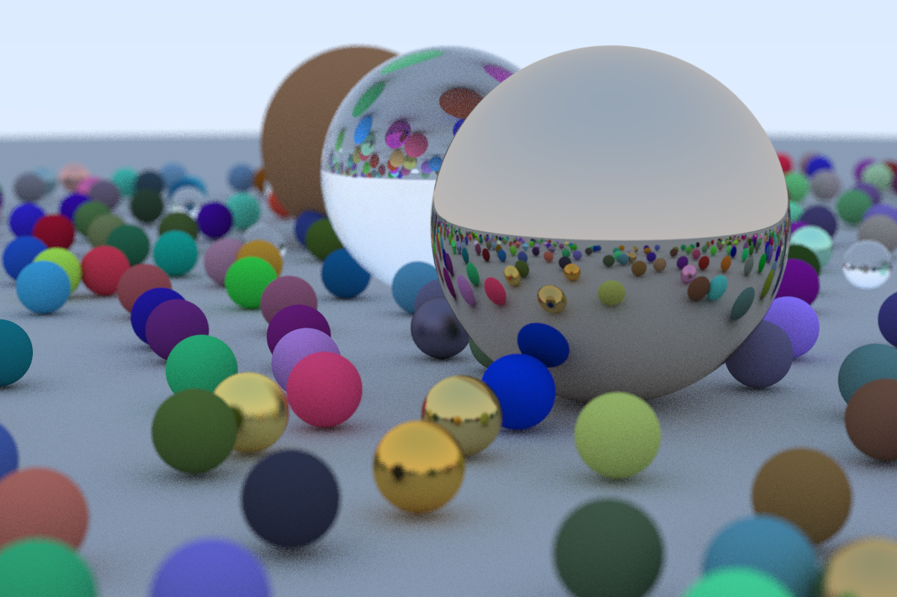
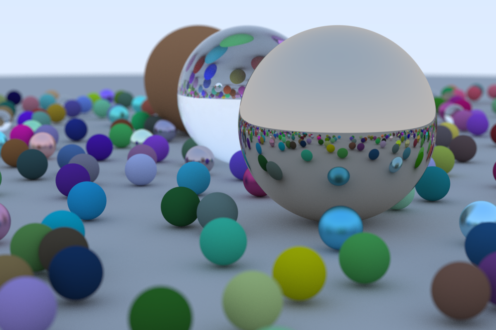

# rtweekend

[Ray Tracing In One Weekend](https://raytracing.github.io/books/RayTracingInOneWeekend.html) written in Rust.

# images

*(samples_per_pixel = 100, max_depth = 10)*

*(samples_per_pixel = 500, max_depth = 50)*